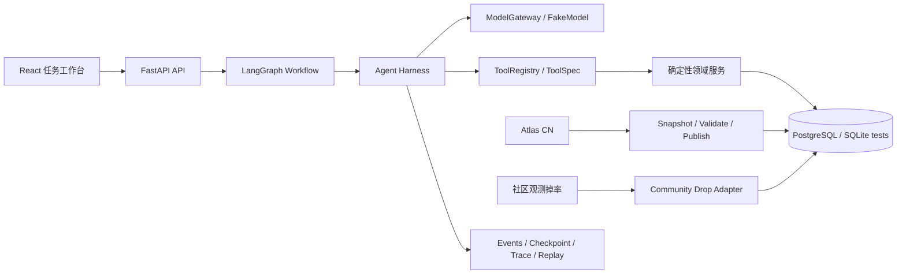
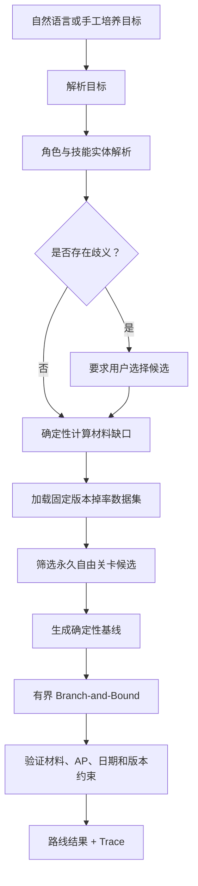

# QuestPilot

> 一个面向复杂养成场景的可验证资源规划 Agent：让 LLM 负责理解目标，让确定性工具负责计算、规划与验证。

QuestPilot 是一个 Backend + AI Agent + Software Engineering 作品集项目。它以复杂养成游戏作为应用场景，将自然语言目标转换为角色培养清单、材料缺口和受资源约束的执行路线，同时保留数据版本、工具调用、验证结果与 Trace。

项目关注的不是“让模型猜答案”，而是如何把 LLM 放进一条可测试、可恢复、可追踪的工程链路中。角色和关卡只是当前领域适配层，Model Gateway、Tool Registry、Workflow、Checkpoint、Evaluation 与可观测性设计可以迁移到其他规划型 Agent。

## 项目背景

复杂养成目标通常同时涉及实体解析、库存状态、分阶段材料消耗、外部数据版本、资源预算与路线优化。单纯依赖 LLM 容易产生错误数值、虚构掉率或不可复现的规划。

QuestPilot 将系统拆分为两类职责：

- **LLM / Agent**：解析自然语言目标、选择工具、生成面向用户的解释；
- **确定性领域层**：计算材料、库存缺口、AP、时间约束和候选路线，并对结果再次验证。

## 核心功能

### 1. 角色、库存与培养目标

- 基于 Atlas Academy CN 数据进行中文角色搜索和技能材料查询；
- 支持精确名称、别名、模糊候选与同名歧义处理；
- 支持多角色、多技能目标的添加、删除与汇总；
- 同一角色同一技能采用“后一次完整覆盖前一次”；
- 确定性计算总需求与 `max(需求 - 库存, 0)` 材料缺口。

### 2. 受控 Tool Calling

- 业务代码通过 `ModelGateway` 调用 OpenAI-compatible Model；
- Agent 只能通过 `ToolRegistry.execute` 执行已注册工具；
- `ToolSpec` 声明输入输出 Schema、只读/幂等属性、超时、重试和确认策略；
- `FakeModel` 与真实模型复用同一调用链，无 API Key 也能运行核心测试；
- 当前真实模型适配为 DeepSeek V4 Flash，并显式关闭 thinking 模式。

### 3. 版本化数据与受约束规划

- Atlas CN 保存角色、材料、关卡、版本和内容哈希等结构化事实；
- 社区掉率通过独立 Adapter 管理，不与 Atlas 事实混合；
- 当前验证数据集覆盖 4 种材料、13 个永久自由关卡；
- 先运行确定性规划基线，再使用有节点数和时间上限的 Branch-and-Bound；
- 优化目标为固定候选集内最小期望 AP，次级目标为较少刷取次数；
- 搜索触及上限时返回经过验证的 best-so-far，并明确标记为降级结果；
- 未覆盖材料返回“无已验证路线”，不猜测掉落率。

### 4. Workflow、恢复与可观测性

- LangGraph 编排目标解析、实体解析、缺口计算、候选搜索、规划和验证；
- `ExecutionContext` 统一关联 run、request、trace、user 和模型配置；
- 统一事件 Schema 覆盖 run、model、tool 与 verification 生命周期；
- PostgreSQL Checkpoint 支持失败恢复和节点重试；
- 执行策略包含预算、超时、幂等重试、循环检测和总步数限制；
- Trace、Replay、Prompt Registry 和 OpenTelemetry 用于定位模型、工具、节点、验证器或数据源问题。

### 5. 前端任务工作台

- React 页面完成角色搜索、库存编辑、多目标清单和材料缺口展示；
- 自然语言一次输入一个或多个培养目标；
- 低置信度或同名候选要求用户确认，不静默纠正；
- 展示模型解析摘要、工具调用步骤、候选数据版本、路线、样本量和资源可达性；
- 从计划结果进入 Trace，查看确定性验证证据。

## 技术架构



### 主要技术栈

| 层级 | 技术 |
|---|---|
| Backend | Python 3.12、FastAPI、Pydantic 2、SQLAlchemy 2、Alembic |
| Agent | LangGraph、OpenAI-compatible HTTP API、DeepSeek、FakeModel |
| Data | PostgreSQL、SQLite（测试）、Atlas Academy CN、版本化社区数据 Adapter |
| Reliability | Checkpoint、预算、Timeout、Retry、循环检测、确定性验证 |
| Observability | 结构化日志、统一事件、Trace、Replay、OpenTelemetry |
| Frontend | React 19、TypeScript、Vite、TanStack Query、Tailwind CSS |
| Quality | Pytest、Ruff、Vitest、Testing Library、Playwright、GitHub Actions |

## 核心流程



模型不会参与材料数量计算、掉落率估计或路线数值优化。

## 工程设计

- **边界隔离**：API 路由只调用应用服务；Agent 节点不直接访问模型 SDK、SQL 或领域计算函数。
- **Schema-first**：模型请求、Tool Call、工具输入输出和 API 响应均经过 Pydantic 校验。
- **可复现数据**：快照记录来源、区域、上游版本、ETag、抓取时间和 SHA-256；发布失败整批回滚。
- **确定性验证**：规划生成后重新计算材料覆盖、库存、AP、日期、候选范围和数据版本。
- **失败降级**：外部数据不可用时保留最后一份已验证快照；求解超限时返回 best-so-far；无真实模型时使用 FakeModel。
- **测试分层**：领域单元测试、Harness 轨迹测试、Adapter/规划器测试、在线模型冒烟和浏览器 E2E 分开报告。
- **敏感信息隔离**：API Key 只从本地 `.env` 读取；`.env`、数据库、缓存、日志和生成报告不会进入 Git。

## 项目结构

```text
QuestPilot/
├─ backend/
│  ├─ src/questpilot/
│  │  ├─ api/                 # FastAPI 路由
│  │  ├─ harness/             # Gateway、Registry、Context、Policy、Checkpoint
│  │  ├─ agent_graph.py       # LangGraph 规划流程
│  │  ├─ data_pipeline.py     # Atlas 快照与发布管线
│  │  ├─ drop_rates.py        # 社区掉率独立 Adapter
│  │  ├─ optimization.py      # 基线与有界 Branch-and-Bound
│  │  ├─ planning_validation.py
│  │  ├─ replay.py / observability.py
│  │  └─ models.py / repositories.py / services.py
│  ├─ migrations/             # Alembic 迁移
│  └─ tests/                  # 后端、Harness、Adapter 与规划测试
├─ frontend/
│  ├─ src/                    # React + TypeScript 任务工作台
│  └─ e2e/                    # Playwright 端到端测试
├─ scripts/                   # 环境诊断、启动、停止和在线冒烟脚本
├─ docs/                      # 架构、数据来源与验收报告
├─ .github/workflows/ci.yml   # 后端与前端 CI
├─ docker-compose.yml         # 可选复现环境
└─ README.md
```

## Quick Start

### 环境要求

- Windows PowerShell（仓库提供一键启动脚本）；
- Python 3.12 与 [uv](https://docs.astral.sh/uv/)；
- Node.js 22 与 npm；
- PostgreSQL 17；测试默认可使用 SQLite Fixture；
- DeepSeek API Key 为可选项，无 Key 时仍可运行离线测试和 FakeModel 流程。

### 1. 安装依赖

```powershell
git clone <repository-url>
cd questpilot

Copy-Item .env.example .env
# 编辑 .env：至少配置本机 DATABASE_URL；真实模型功能再填写 MODEL_API_KEY

cd backend
uv sync --extra dev
uv run alembic upgrade head
uv run questpilot-seed

cd ..\frontend
npm install
cd ..
```

### 2. 启动

```powershell
.\scripts\doctor.ps1
.\scripts\start.ps1
```

启动脚本会检查前后端健康状态并打印地址：

- Web：<http://127.0.0.1:5173/>
- API 文档：<http://127.0.0.1:8000/docs>

停止脚本启动的进程：

```powershell
.\scripts\stop.ps1
```

也可以分别启动：

```powershell
# PowerShell 1
cd backend
uv run questpilot-api

# PowerShell 2
cd frontend
npm run dev
```

### 3. 可选真实数据

同步演示使用的 Atlas CN 角色：

```powershell
cd backend
uv run questpilot-atlas --collection-no 254 262 324 189
```

社区掉率原始文件不会进入 Git。复现真实规划数据时，按 `backend/data/drop-dataset-manifest.json` 中固定的 `source_url` 下载文件并核对 SHA-256，然后执行：

```powershell
uv run questpilot-drop-data <本地dropData.json路径> --manifest data/drop-dataset-manifest.json
```

经许可图片只缓存到本地；下载失败时使用文字可理解的占位图：

```powershell
cd ..
.\scripts\cache-assets.ps1
```

## 测试与 Evaluation

```powershell
cd backend
uv run ruff check src tests
uv run pytest
uv run questpilot-eval

cd ..\frontend
npm test
npm run build
npm run test:e2e
```

最近一次完整验收结果：

- Backend：52 项通过，1 项在线 Atlas 契约测试默认跳过；
- Frontend：Vitest 6/6，Playwright E2E 3/3，生产构建通过；
- 材料缺口单元评测：50/50；
- DeepSeek 自然语言解析冒烟：12/12；
- DeepSeek 真实规划冒烟：10/10。

`questpilot-eval` 是“材料缺口单元评测”，不等同于完整 Agent 评测。在线模型测试需要先启动服务并在本地 `.env` 配置密钥：

```powershell
.\scripts\deepseek-smoke.ps1
.\scripts\deepseek-planning-smoke.ps1
```

## 数据来源与许可边界

- **Atlas Academy CN**：角色、中文名称、技能材料和关卡结构化事实；
- **社区掉率**：独立的社区观测数据，保存版本、哈希和样本量，不作为 Atlas 事实；
- **本地图片**：用户已许可用于本地演示和作品展示，下载失败不影响核心计算。

`chaldea-data` 固定版本当前没有仓库级许可证声明，因此原始掉率文件只保存在 gitignored 本地缓存，不提交、不打包、不通过 API 提供下载。仓库仅包含 Adapter、版本清单和合成测试数据。规划结果只声明固定候选集内的局部最优。

详细说明见 [数据来源](docs/data-sources.md) 和 [P6 真实规划验收报告](docs/p6-planning-acceptance-report.md)。

## 当前边界与 Future Work

### 已实现但仍属演示/实验范围

- Mooncell RAG 的抓取、切分、检索和引用管线已有实现，但仓库只包含合成演示内容，未填充生产语料；
- MCP Server 入口复用同一 `ToolRegistry`，未作为本阶段的生产集成目标；
- Docker Compose、Redis 与对象存储 Adapter 是可选复现能力，本机核心开发不依赖它们。

### 尚未实现

- 公开云部署与多用户身份系统；
- 全量掉率、活动动态规划和全服全局最优；
- 截图识别、完整伤害模拟、复杂队伍推荐和多 Agent 协作；
- 经许可复核后的 Mooncell 生产语料库。

## License

当前仓库尚未附加开源许可证。公开可读不等于允许复制、修改或再分发；仓库所有者可在确认发布策略后补充合适的许可证。

## 更多文档

- [架构说明](docs/architecture.md)
- [数据来源与许可边界](docs/data-sources.md)
- [M1 验收报告](docs/m1-acceptance-report.md)
- [P6 真实规划验收报告](docs/p6-planning-acceptance-report.md)
- [演示脚本](docs/demo-script.md)
