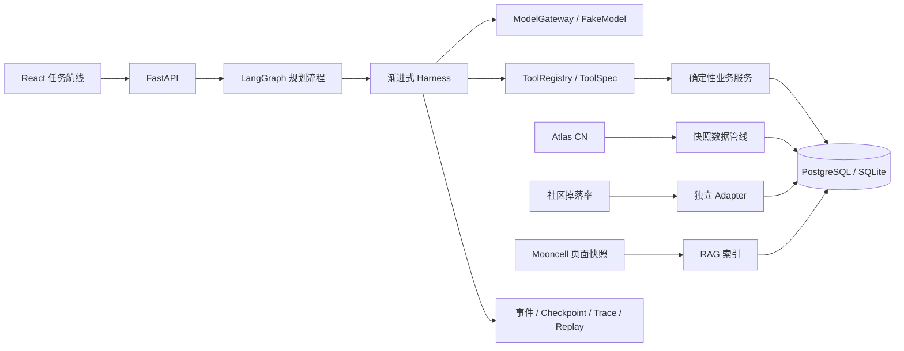

# 架构说明

核心边界：

1. 路由和 Agent 节点不直接调用模型 SDK。
2. Agent 的业务能力只能通过 `ToolRegistry.execute`。
3. 精确数值由领域服务和验证器计算，模型不能覆盖。
4. Atlas 事实、社区观测掉落率和 Mooncell 解释性证据分表、分适配器保存。
5. M3 规划器只比较版本固定的小规模永久自由关卡候选集。

本机 PostgreSQL 未安装 pgvector 时，RAG 使用 JSON 中的 96 维确定性哈希向量；设置
`PGVECTOR_ENABLED=true` 并在迁移前安装扩展后，`0002` 迁移会增加原生 `vector(96)` 列。

LangGraph 节点顺序为：

`parse_goal → resolve_entities → load_account → calculate_gap → load_drop_dataset → search_candidates → generate_plan → validate_plan → fallback/complete`
